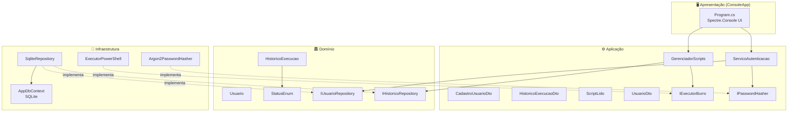
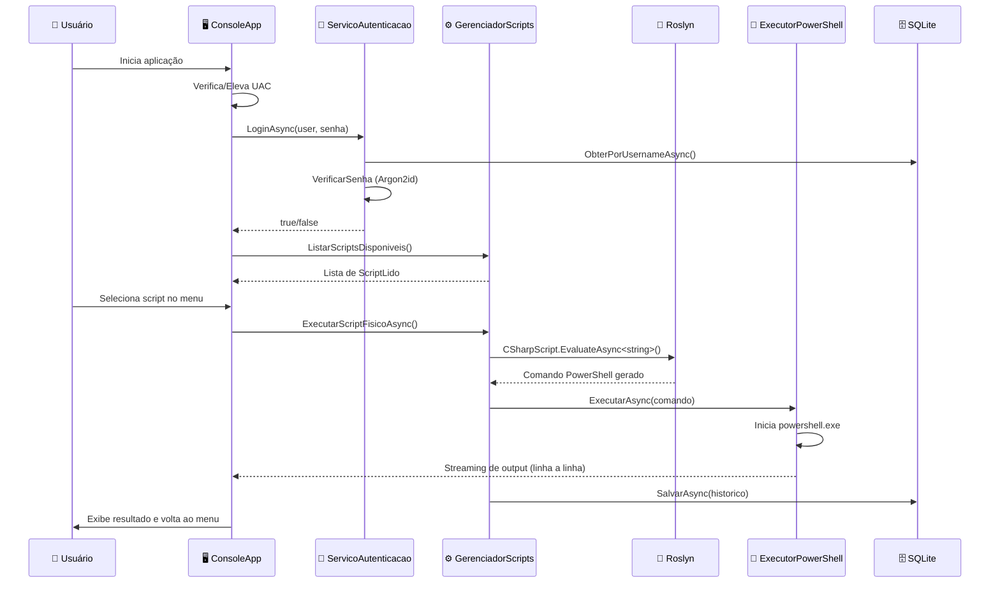

# Arquitetura do InfoX

## Padrão Arquitetural

O InfoX segue os princípios da **Onion Architecture** (Clean Architecture), com separação clara de responsabilidades em 4 camadas concêntricas. As dependências fluem sempre de fora para dentro — a camada de Domínio (núcleo) não conhece nenhuma camada externa.

## Diagrama da Arquitetura



## Camadas

### 1. Domain (Domínio) — Camada Interna

A camada mais pura do projeto. **Zero dependências externas** (nenhum pacote NuGet).

| Componente | Tipo | Descrição |
|------------|------|-----------|
| `Usuario` | Entidade | Usuário para autenticação |
| `HistoricoExecucao` | Entidade | Registro de execução de scripts |
| `StatusEnum` | Enum | Status de execução (Concluido, Rodando, Cancelado, Erro) |
| `IUsuarioRepository` | Interface | Contrato de persistência de usuários |
| `IHistoricoRepository` | Interface | Contrato de persistência de histórico |

📄 Documentação completa: [dominio.md](dominio.md)

---

### 2. Application (Aplicação) — Casos de Uso

Orquestra a lógica de negócio. Define interfaces para serviços de infraestrutura. Depende apenas do Domain.

| Componente | Tipo | Descrição |
|------------|------|-----------|
| `GerenciadorScripts` | Use Case | Descobre, compila (Roslyn) e executa scripts C# |
| `ServicoAutenticacao` | Use Case | Login, cadastro e seed de usuário padrão |
| `IExecutorBurro` | Interface | Contrato para execução de comandos do SO |
| `IPasswordHasher` | Interface | Contrato para hashing de senhas |
| `CadastroUsuarioDto` | DTO | Dados para cadastro de usuário |
| `HistoricoExecucaoDto` | DTO | Dados formatados do histórico |
| `ScriptLido` | Model | Representação de um script descoberto no disco |
| `UsuarioDto` | DTO | Dados do usuário (sem senha) |

**Pacotes**: Roslyn (CSharpScript), Spectre.Console, Argon2

---

### 3. Infrastructure (Infraestrutura) — Implementações Concretas

Implementa os contratos definidos nas camadas internas. Depende de Domain e Application.

| Componente | Tipo | Implementa | Descrição |
|------------|------|------------|-----------|
| `AppDbContext` | DbContext | — | Contexto EF Core para SQLite |
| `SqliteRepository` | Repositório | `IUsuarioRepository` + `IHistoricoRepository` | Repositório unificado |
| `Argon2PasswordHasher` | Serviço | `IPasswordHasher` | Hashing Argon2id |
| `ExecutorPowerShell` | Serviço | `IExecutorBurro` | Execução de PowerShell com streaming |

**Pacotes**: EF Core SQLite, SQLitePCLRaw, Roslyn

📄 Documentação completa: [infraestrutura.md](infraestrutura.md)

---

### 4. ConsoleApp (Apresentação) — Interface de Terminal

Ponto de entrada da aplicação. Configura DI, autenticação e renderiza a UI interativa.

| Componente | Tipo | Descrição |
|------------|------|-----------|
| `Program.cs` | Entry Point | Auto-elevação UAC, DI, login, menu principal, execução |
| `app.manifest` | Manifesto | Requisita privilégios de administrador |

**Target**: `net10.0-windows` | **Pacotes**: EF Core, DI, Spectre.Console

📄 Documentação completa: [console-app.md](console-app.md)

## Estrutura de Diretórios

```
infoX/
├── Solution.slnx
├── Domain/                         # 🏛️ Domínio
│   ├── Domain.csproj
│   ├── Entities/
│   │   ├── HistoricoExecucao.cs
│   │   └── Usuario.cs
│   ├── Enums/
│   │   └── StatusEnum.cs
│   └── Interfaces/
│       ├── IHistoricoRepository.cs
│       └── IUsuarioRepository.cs
├── Application/                    # ⚙️ Aplicação
│   ├── Application.csproj
│   ├── Interfaces/
│   │   ├── IExecutorBurro.cs
│   │   └── IPasswordHasher.cs
│   ├── Models/
│   │   ├── CadastroUsuarioDto.cs
│   │   ├── HistoricoExecucaoDto.cs
│   │   ├── ScriptLido.cs
│   │   └── UsuarioDto.cs
│   └── UseCases/
│       ├── GerenciadorScripts.cs
│       └── ServicoAutenticacao.cs
├── Infrastructure/                 # 🔌 Infraestrutura
│   ├── Infrastructure.csproj
│   ├── Context/
│   │   └── AppDbContext.cs
│   ├── Repositories/
│   │   └── SqliteRepository.cs
│   └── Services/
│       ├── Argon2PasswordHasher.cs
│       └── ExecutorPowerShell.cs
├── ConsoleApp/                     # 🖥️ Apresentação
│   ├── ConsoleApp.csproj
│   ├── Program.cs
│   └── app.manifest
└── Scripts/                        # 📜 Scripts Dinâmicos
    ├── 01_BaixarVarredurasVirus.cs
    ├── 02_ManutencaoDoSistema.cs
    ├── 03_Winget.cs
    ├── 04_Limpezas.cs
    ├── 05_Inventario.cs
    ├── 06_DefinirProgramasPadrao.cs
    ├── 07_AgendadorDeTarefas.cs
    ├── 08_Firewall.cs
    ├── 09_PontoDeRestauracao.cs
    ├── 12_Win11Debloat.cs
    ├── Teste.cs
    └── Futuras implementações.md
```

## Fluxo de Dados



## Injeção de Dependência

Configurada no `Program.cs` via `Microsoft.Extensions.DependencyInjection`:

```csharp
var services = new ServiceCollection();

// Persistência
services.AddDbContext<AppDbContext>();
services.AddScoped<IUsuarioRepository, SqliteRepository>();
services.AddScoped<IHistoricoRepository, SqliteRepository>();

// Serviços de Infraestrutura
services.AddScoped<IExecutorBurro, ExecutorPowerShell>();
services.AddScoped<IPasswordHasher, Argon2PasswordHasher>();

// Casos de Uso
services.AddScoped<ServicoAutenticacao>();
services.AddScoped<GerenciadorScripts>();
```

Todas as dependências são registradas como **Scoped** — uma nova instância é criada para cada escopo de serviço.

## Padrões e Decisões Técnicas

### Mapeamento Manual
O projeto utiliza **mapeamento inline** em vez de bibliotecas como AutoMapper ou Mapster:
- `ScriptLido` ← caminho do arquivo no disco
- `Usuario` ← `CadastroUsuarioDto`
- `HistoricoExecucao` ← dados da execução

### Validação Manual
Sem frameworks de validação (FluentValidation, DataAnnotations). Usa guard clauses:
- `File.Exists()` para verificar scripts
- `ct.ThrowIfCancellationRequested()` para cancelamento
- Null checks em retornos de repositório

### Repositório Unificado
`SqliteRepository` implementa **ambas** as interfaces de repositório (`IUsuarioRepository` + `IHistoricoRepository`) em uma única classe, simplificando o projeto.

### Sem Migrations
O banco é criado via `EnsureCreated()` — adequado para a natureza da aplicação (utilitário local, não sistema distribuído).
