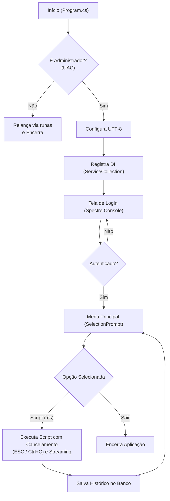
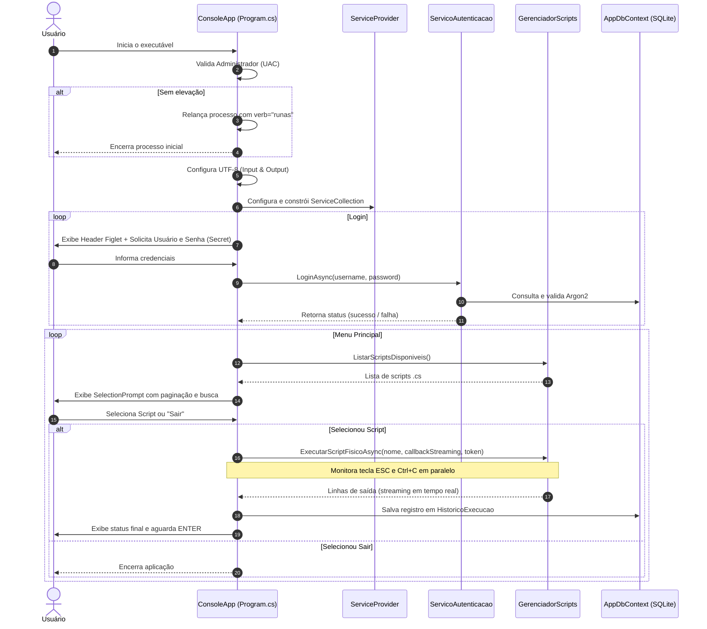

# ConsoleApp — Camada de Apresentação

## Visão Geral

O **ConsoleApp** é o ponto de entrada executável e a camada de apresentação do InfoX. Projetado como uma aplicação de console interativa moderna para Windows, ele utiliza a biblioteca **Spectre.Console** para fornecer uma interface de terminal rica (TUI - Terminal User Interface), com formatação tipográfica em ASCII (Figlet), painéis estilizados, menus navegáveis com suporte a busca dinâmica, paginação responsiva, mascaramento de senhas e streaming de saída em tempo real.



---

## Configuração do Projeto

### ConsoleApp.csproj

O projeto é configurado como um executável direcionado especificamente para o ecossistema Windows (`net10.0-windows`), viabilizando a integração com o Controle de Conta de Usuário (UAC) e APIs nativas do sistema operacional.

```xml
<Project Sdk="Microsoft.NET.Sdk">

  <PropertyGroup>
    <OutputType>Exe</OutputType>
    <TargetFramework>net10.0-windows</TargetFramework>
    <CopyLocalLockFileAssemblies>true</CopyLocalLockFileAssemblies>
    <ImplicitUsings>enable</ImplicitUsings>
    <Nullable>enable</Nullable>
    <Version>1.4.1</Version>
    <IncludeNativeLibrariesForSelfExtract>true</IncludeNativeLibrariesForSelfExtract>
    <SatelliteResourceLanguages>pt-BR</SatelliteResourceLanguages>
  </PropertyGroup>

  <ItemGroup>
    <None Include="Scripts\**\*" CopyToOutputDirectory="PreserveNewest" />
    <ProjectReference Include="..\Application\Application.csproj" />
    <ProjectReference Include="..\Infrastructure\Infrastructure.csproj" />
  </ItemGroup>

  <ItemGroup>
    <PackageReference Include="Microsoft.EntityFrameworkCore" Version="10.0.10" />
    <PackageReference Include="Microsoft.Extensions.DependencyInjection" Version="10.0.10" />
    <PackageReference Include="Spectre.Console" Version="0.57.2" />
  </ItemGroup>

  <Target Name="RemoverPastasVazias" AfterTargets="Publish">
    <ItemGroup>
      <PastasDoPublish Include="$([System.IO.Directory]::GetDirectories('$(PublishDir)', '*', System.IO.SearchOption.AllDirectories))" />
    </ItemGroup>
    <RemoveDir Directories="@(PastasDoPublish)" />
  </Target>

</Project>
```

#### Destaques de Configuração

- **`TargetFramework: net10.0-windows`**: Garante compatibilidade com tipos do namespace `System.Security.Principal` e comandos de privilégio de segurança do Windows.
- **`CopyLocalLockFileAssemblies` & `IncludeNativeLibrariesForSelfExtract`**: Asseguram que todas as DLLs e dependências nativas (como `e_sqlite3.dll`) sejam copiadas e integradas corretamente em cenários de publicação/extração.
- **`SatelliteResourceLanguages: pt-BR`**: Restringe os recursos de localização para o português brasileiro, evitando a geração de pastas desnecessárias para idiomas não utilizados.
- **Cópia de Scripts**: A diretiva `<None Include="Scripts\**\*" CopyToOutputDirectory="PreserveNewest" />` garante que todos os scripts C# na pasta `Scripts/` sejam sincronizados para o diretório de execução sempre que modificados.
- **Target Customizado `RemoverPastasVazias`**: Executa no estágio pós-publicação (`AfterTargets="Publish"`) para varrer e remover diretórios vazios residuais no diretório de saída (`PublishDir`).

---

### Dependências

O ConsoleApp referencia diretamente as camadas internas `Application` e `Infrastructure`, além dos pacotes NuGet essenciais:

| Pacote / Referência | Versão | Finalidade |
|---------------------|--------|------------|
| `Microsoft.EntityFrameworkCore` | `10.0.10` | ORM para acesso ao banco de dados SQLite |
| `Microsoft.Extensions.DependencyInjection` | `10.0.10` | Container de Inversão de Controle (IoC) e Injeção de Dependências |
| `Spectre.Console` | `0.57.2` | Criação de interface de usuário rica no terminal (prompts, cores, painéis, tabelas, ASCII Art) |
| `Application.csproj` | Projeto | Contratos, DTOs e Casos de Uso (`ServicoAutenticacao`, `GerenciadorScripts`) |
| `Infrastructure.csproj` | Projeto | Implementações concretas de Repositórios, Contexto EF Core, Hasher Argon2 e Executores |

---

### Manifesto UAC (`app.manifest`)

Para executar tarefas de manutenção, limpeza de sistema e comandos administrativos do PowerShell, o InfoX exige privilégios de Administrador. O arquivo `app.manifest` define a política de elevação exigida:

```xml
<?xml version="1.0" encoding="utf-8"?>
<assembly manifestVersion="1.0" xmlns="urn:schemas-microsoft-com:asm.v1">
  <assemblyIdentity version="1.0.0.0" name="InfoX.app"/>
  <trustInfo xmlns="urn:schemas-microsoft-com:asm.v2">
    <security>
      <requestedPrivileges xmlns="urn:schemas-microsoft-com:asm.v3">
        <requestedExecutionLevel level="requireAdministrator" uiAccess="true" />
      </requestedPrivileges>
    </security>
  </trustInfo>
</assembly>
```

> [!IMPORTANT]
> A diretiva `<requestedExecutionLevel level="requireAdministrator" uiAccess="true" />` força o Windows a exibir o prompt de UAC ao iniciar o executável ou solicitar elevação automática quando disparado sem privilégios.

---

## Fluxo de Execução (`Program.cs`)

O ciclo de vida da aplicação é estruturado em etapas sequenciais no método `Program.Main`:



---

### 1. Auto-Elevação UAC

Logo na inicialização, a aplicação verifica se a instância atual possui direitos de Administrador utilizando `WindowsPrincipal`:

```csharp
WindowsIdentity identity = WindowsIdentity.GetCurrent();
WindowsPrincipal principal = new WindowsPrincipal(identity);
bool isAdmin = principal.IsInRole(WindowsBuiltInRole.Administrator);

if (!isAdmin)
{
    ProcessStartInfo startInfo = new ProcessStartInfo
    {
        FileName = Environment.ProcessPath,
        UseShellExecute = true,
        Verb = "runas"
    };

    try
    {
        Process.Start(startInfo);
    }
    catch
    {
        Console.WriteLine("O usuário recusou a permissão de administrador.");
        Thread.Sleep(2000);
    }

    return;
}
```

- Se **não for admin**, dispara uma nova instância solicitando elevação (`Verb = "runas"`) e encerra o processo corrente imediatamente.
- Se o usuário rejeitar a caixa de diálogo do UAC, uma mensagem é exibida antes do encerramento.

---

### 2. Configuração de Encoding

Para renderizar corretamente símbolos ANSI, bordas arredondadas de caixas, caracteres especiais do Spectre.Console e textos com acentuação em português:

```csharp
Console.OutputEncoding = System.Text.Encoding.UTF8;
Console.InputEncoding = System.Text.Encoding.UTF8;
```

---

### 3. Injeção de Dependência

A aplicação configura um container de DI via `Microsoft.Extensions.DependencyInjection`:

```csharp
var services = new ServiceCollection();

services.AddDbContext<AppDbContext>();

services.AddScoped<IUsuarioRepository, SqliteRepository>();
services.AddScoped<IHistoricoRepository, SqliteRepository>();
services.AddScoped<IExecutorBurro, ExecutorPowerShell>();
services.AddScoped<IPasswordHasher, Argon2PasswordHasher>();

services.AddScoped<ServicoAutenticacao>();
services.AddScoped<GerenciadorScripts>();

var serviceProvider = services.BuildServiceProvider();
```

#### Mapeamento de Serviços

| Interface / Serviço | Implementação | Escopo | Descrição |
|---------------------|---------------|--------|-----------|
| `AppDbContext` | `AppDbContext` | Scoped | Contexto do Entity Framework Core com SQLite |
| `IUsuarioRepository` | `SqliteRepository` | Scoped | Operações de persistência de usuários |
| `IHistoricoRepository` | `SqliteRepository` | Scoped | Persistência do histórico de execuções |
| `IExecutorBurro` | `ExecutorPowerShell` | Scoped | Execução de scripts via PowerShell com streaming |
| `IPasswordHasher` | `Argon2PasswordHasher` | Scoped | Criptografia e verificação de senhas via Argon2id |
| `ServicoAutenticacao` | `ServicoAutenticacao` | Scoped | Regras de negócio de autenticação e seed inicial de admin |
| `GerenciadorScripts` | `GerenciadorScripts` | Scoped | Descoberta, parsing e orquestração de execução de scripts |

---

### 4. Tela de Login

A autenticação é obrigatória para acessar o sistema. O fluxo inclui:

1. **Painel de Cabeçalho**: Exibição do logo Figlet em `DeepSkyBlue1` com versão e autor.
2. **Seed Automático**: O `ServicoAutenticacao` assegura a criação do usuário padrão administrador caso o banco esteja vazio.
3. **Entrada Segura**:
   - `AnsiConsole.Ask<string>("[cyan]Usuário:[/]")` para captura do nome de usuário.
   - `new TextPrompt<string>("[cyan]Senha:[/]").PromptStyle("red").Secret()` para digitação oculta de senha.
4. **Loop de Tentativas**: Em caso de credenciais incorretas, exibe feedback em vermelho e repete o prompt.

```csharp
while (!autenticado)
{
    var username = AnsiConsole.Ask<string>("[cyan]Usuário:[/]");

    var password = AnsiConsole.Prompt(
        new TextPrompt<string>("[cyan]Senha:[/]")
            .PromptStyle("red")
            .Secret());

    autenticado = await authService.LoginAsync(username, password);

    if (!autenticado)
    {
        ExibirCabecalho(versaoInfoX);
        AnsiConsole.MarkupLine("[red]Credenciais inválidas! Tente novamente.[/]\n");
    }
}
```

---

### 5. Menu Principal

O menu inicializa listando todos os scripts `.cs` presentes no diretório `Scripts/` e adiciona a opção de saída:

- **Busca em Tempo Real**: `.EnableSearch()` permite filtrar scripts digitando qualquer termo.
- **Paginação Dinâmica**: O tamanho da página adapta-se à altura da janela do terminal:
  ```csharp
  int pageSize = Math.Clamp(Console.WindowHeight - 16, 5, 25);
  ```
- **Formatação Amigável**: `.UseConverter()` renderiza nomes legíveis (remove a extensão `.cs` e destaca a opção `[red]Sair do Sistema[/]`).

```csharp
var scriptEscolhido = AnsiConsole.Prompt(
    new SelectionPrompt<ScriptLido>()
        .Title("[bold deepskyblue1]Scripts Disponíveis[/]\n[grey]([cyan]↑/↓[/] navegar • digite para buscar • [cyan]Enter[/] confirmar)[/]")
        .PageSize(pageSize)
        .EnableSearch()
        .UseConverter(s => s.NomeArquivo == "Sair" ? "[red]Sair do Sistema[/]" : s.NomeAmigavel)
        .AddChoices(scripts)
);
```

---

### 6. Execução de Scripts e Tratamento de Cancelamento

A execução de cada script integra monitoramento de cancelamento e streaming de log em tempo real:

1. **Tokens de Cancelamento**: Criação de instâncias `CancellationTokenSource` para abortar tarefas em andamento.
2. **Monitoramento da Tecla ESC**: Uma tarefa em segundo plano monitora `Console.KeyAvailable` e cancela a execução se **ESC** for pressionado:
   ```csharp
   var monitorTecla = Task.Run(() =>
   {
       while (!keyMonitorCts.Token.IsCancellationRequested)
       {
           if (Console.KeyAvailable)
           {
               var tecla = Console.ReadKey(intercept: true);
               if (tecla.Key == ConsoleKey.Escape)
               {
                   cts.Cancel();
                   break;
               }
           }
           Thread.Sleep(50);
       }
   }, keyMonitorCts.Token);
   ```
3. **Interceptação de Ctrl+C**: Registro de handler em `Console.CancelKeyPress` impedindo o encerramento abrupto e acionando o token de cancelamento gracioso.
4. **Streaming de Saída**: O callback `printarLinhaTempoReal` formata cada linha emitida com o prefixo `[grey]>[/]`.
5. **Persistência**: O resultado da execução (sucesso, falha ou cancelamento) é salvo no banco de dados SQLite através do caso de uso.

---

### 7. Loop de Interação

Ao término da execução (ou cancelamento), o console exibe uma régua de finalização (`[green]Execução Finalizada[/]`) e aguarda o usuário pressionar **ENTER** para retornar ao menu principal. A seleção da opção `"Sair"` encerra o laço e finaliza o programa.

---

## Interface Visual (Spectre.Console)

O InfoX aproveita extensivamente os recursos do **Spectre.Console** para proporcionar uma experiência visual agradável e intuitiva:

| Componente | Utilização no InfoX | Exemplo Visual / Código |
|------------|---------------------|--------------------------|
| **`FigletText`** | Renderização do título "InfoX" no cabeçalho principal | `new FigletText("InfoX").Color(Color.DeepSkyBlue1)` |
| **`Panel` & `Grid`** | Molduras arredondadas e alinhamento do cabeçalho com versão e autor | `new Panel(layout) { Border = BoxBorder.Rounded }` |
| **`SelectionPrompt<T>`** | Menu interativo com paginação, busca e navegação por setas | Seleção do script no Menu Principal |
| **`MultiSelectionPrompt<T>`** | Seleção de múltiplos itens em scripts de manutenção (ex: limpeza de caches) | Seleção de componentes em lote |
| **`TextPrompt<T>.Secret()`** | Ocultação de caracteres na tela de login | Digitação segura de senhas |
| **`AnsiConsole.Confirm()`** | Diálogos de confirmação (Sim/Não) antes de operações críticas | Confirmações de limpeza ou modificações de sistema |
| **`Rule`** | Separadores horizontais rotulados de início e fim de execução | `new Rule("[green]Execução Finalizada[/]").LeftJustified()` |
| **`Markup`** | Paleta de cores semântica em todo o terminal | `[grey]`, `[red]`, `[green]`, `[cyan]`, `[yellow]`, `[deepskyblue1]` |

---

## Backlog de Melhorias

Com base nas definições de evolução do projeto (`ideias iplementar.txt`), as seguintes melhorias estão mapeadas para as próximas versões do ConsoleApp:

1. **Rodapé com Última Execução**: Exibir no rodapé do menu principal os dados da última rotina executada (script, horário e status), consultados diretamente da tabela de histórico no SQLite.
2. **Recarregamento a Quente (Hot-Reload)**: Implementar opção no menu para recarregar a lista de scripts da pasta `Scripts/` e restabelecer conexões do banco sem a necessidade de reiniciar o executável.
3. **Visualizador Interativo de Histórico**: Criar tela com tabela paginada (`Table` do Spectre.Console) permitindo filtrar, ordenar e inspecionar detalhes de execuções anteriores.
4. **Módulo de Gerenciamento de Usuários (CRUD)**: Interface administrativa para criar, listar, alterar senhas e desativar usuários diretamente pelo console.
