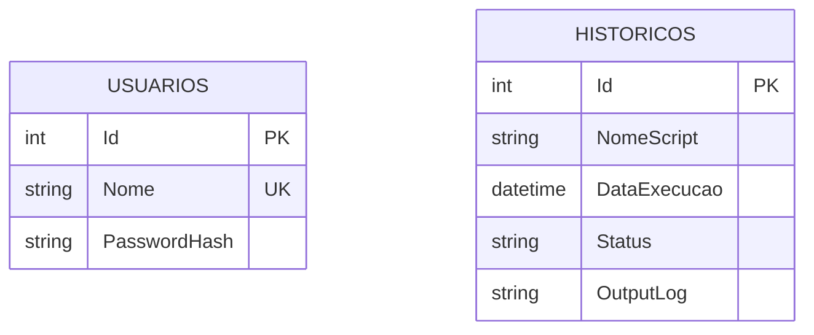

# Banco de Dados — InfoX

## Visão Geral
O InfoX utiliza **SQLite** como banco de dados embarcado, gerenciado via **Entity Framework Core 10.0.10**. O arquivo do banco é `infoX.db`, localizado no diretório base da aplicação (`AppContext.BaseDirectory`).

## Estratégia de Criação
- **Sem Migrations**: O projeto não utiliza EF Core Migrations.
- **EnsureCreated**: O banco é criado automaticamente via `_context.Database.EnsureCreated()` no construtor do `SqliteRepository`.
- O schema é derivado automaticamente das configurações Fluent API no `AppDbContext`.

## Diagrama ER


## Tabelas

### Usuarios
| Coluna | Tipo | Restrições | Descrição |
|--------|------|------------|----------|
| Id | INTEGER | PK, Auto-increment | Identificador único |
| Nome | TEXT | UNIQUE, NOT NULL | Nome de usuário |
| PasswordHash | TEXT | NOT NULL | Hash Argon2id da senha |

### Historicos
| Coluna | Tipo | Restrições | Descrição |
|--------|------|------------|----------|
| Id | INTEGER | PK, Auto-increment | Identificador único |
| NomeScript | TEXT | NOT NULL | Nome do script executado |
| DataExecucao | TEXT (datetime) | NOT NULL | Data/hora da execução |
| Status | TEXT | NOT NULL | Status da execução (armazenado como string) |
| OutputLog | TEXT | NOT NULL | Log completo de saída |

## Configurações Fluent API (AppDbContext)

### Usuario
```csharp
entity.HasKey(e => e.Id);
entity.HasIndex(e => e.Nome).IsUnique(); // Impede usernames duplicados
```

### HistoricoExecucao
```csharp
entity.HasKey(e => e.Id);
entity.Property(e => e.Status).HasConversion<string>(); // Enum → string no banco
```

## Valores do StatusEnum no banco
| Valor armazenado | Enum | Descrição |
|-----------------|------|----------|
| "Concluido" | StatusEnum.Concluido (0) | Execução finalizada com sucesso |
| "Rodando" | StatusEnum.Rodando (1) | Execução em andamento |
| "Cancelado" | StatusEnum.Cancelado (2) | Execução cancelada pelo usuário |
| "Erro" | StatusEnum.Erro (3) | Execução falhou com erro |

## Repositório (SqliteRepository)
O `SqliteRepository` implementa ambas as interfaces `IUsuarioRepository` e `IHistoricoRepository` em uma única classe.

### Operações de Usuário
| Método | Descrição |
|--------|-----------|
| `ObterUsuariosAsync()` | Retorna todos os usuários |
| `ObterPorUsernameAsync(nome)` | Busca usuário por nome (case-insensitive) |
| `CadastrarUsuarioAsync(usuario)` | Cadastra novo usuário |
| `ExcluirUsuarioAsync(nome)` | Exclui usuário por nome |
| `ExisteAlgumUsuarioAsync()` | Verifica se existe ao menos um usuário |

### Operações de Histórico
| Método | Descrição |
|--------|-----------|
| `SalvarAsync(historico)` | Salva registro de execução |
| `ObterHistoricoAsync()` | Retorna histórico ordenado por data (desc) |

## Usuário Padrão
Na primeira execução, se não houver nenhum usuário cadastrado, o `ServicoAutenticacao` cria automaticamente:
- **Usuário**: `admin`
- **Senha**: `1234`
- A senha é armazenada como hash Argon2id

## Segurança de Senhas (Argon2id)
O hash é gerado pelo `Argon2PasswordHasher` com os seguintes parâmetros:
- **Algoritmo**: Argon2id
- **Memória**: 65.536 KB (64 MB)
- **Iterações**: 4
- **Paralelismo**: 2
- **Salt**: 16 bytes (RandomNumberGenerator)
- **Hash**: 32 bytes
- **Formato**: `$argon2id$v=19$m=65536,t=4,p=2$<Base64Salt>$<Base64Hash>`
- **Verificação**: Usa `CryptographicOperations.FixedTimeEquals` para prevenir ataques de timing
