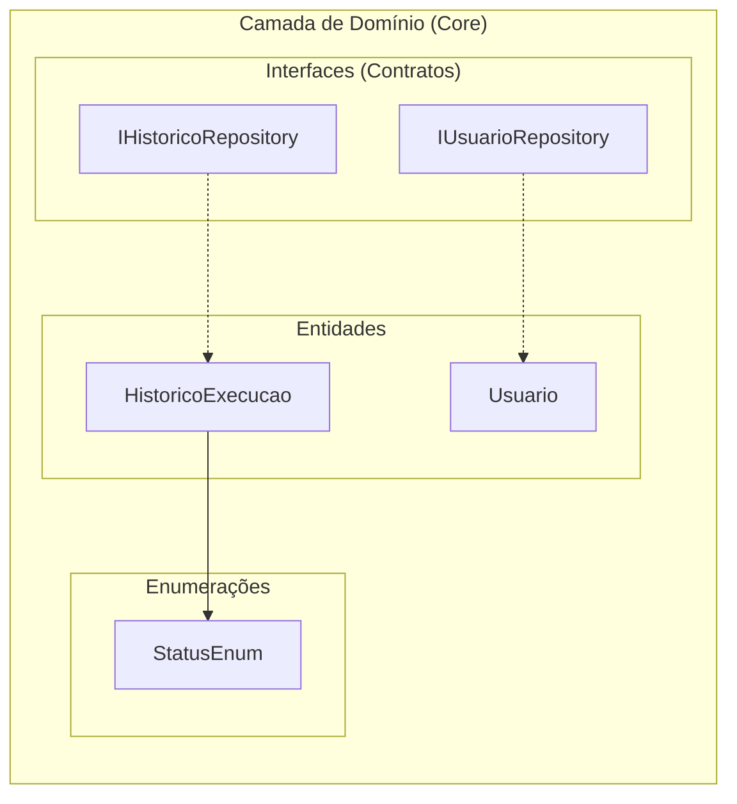

# Camada de Domínio (Domain)

## Visão Geral
A camada de Domínio é o núcleo do InfoX, contendo as entidades de negócio, enumerações e contratos de repositório. Seguindo os princípios de Clean Architecture, esta camada **não possui nenhuma dependência externa** — zero pacotes NuGet.



## Configuração
- **Target Framework**: .NET 10.0
- **Nullable**: `enable`
- **ImplicitUsings**: `enable`
- **Dependências**: Nenhuma

## Estrutura
```
Domain/
├── Domain.csproj
├── Entities/
│   ├── HistoricoExecucao.cs
│   └── Usuario.cs
├── Enums/
│   └── StatusEnum.cs
└── Interfaces/
    ├── IHistoricoRepository.cs
    └── IUsuarioRepository.cs
```

## Entidades

### Usuario
**Namespace**: `Domain.Entities`

Representa um usuário da aplicação para autenticação e controle de acesso.

| Propriedade | Tipo | Descrição |
|-------------|------|-----------|
| `Id` | `int` | Identificador único (auto-increment) |
| `Nome` | `string` | Nome de usuário |
| `PasswordHash` | `string` | Hash Argon2id da senha |

**Construtores**:
- `Usuario()` — Construtor padrão (parameterless)
- `Usuario(string nome, string passwordHash)` — Inicializa `Nome` e `PasswordHash`

---

### HistoricoExecucao
**Namespace**: `Domain.Entities`

Representa o registro de log de cada execução de script no sistema.

| Propriedade | Tipo | Descrição |
|-------------|------|-----------|
| `Id` | `int` | Identificador único (auto-increment) |
| `NomeScript` | `string` | Nome do script executado |
| `DataExecucao` | `DateTime` | Data e hora da execução |
| `Status` | `StatusEnum` | Status final da execução |
| `OutputLog` | `string` | Log completo de saída |

**Construtores**:
- `HistoricoExecucao()` — Construtor padrão
- `HistoricoExecucao(string nome, StatusEnum status, string resultado)` — Inicializa `NomeScript`, `Status` e `OutputLog`
- `HistoricoExecucao(HistoricoExecucao historicoExecucao)` — Construtor de cópia

## Enumerações

### StatusEnum
**Namespace**: `Domain.Enums`

Define os possíveis status de uma execução de script.

| Valor | Nome | Descrição |
|-------|------|-----------|
| `0` | `Concluido` | Execução finalizada com sucesso |
| `1` | `Rodando` | Execução em andamento |
| `2` | `Cancelado` | Execução cancelada pelo usuário |
| `3` | `Erro` | Execução falhou com erro |

## Interfaces (Contratos de Repositório)

### IHistoricoRepository
**Namespace**: `Domain.Interfaces`

Contrato para persistência do histórico de execuções.

| Método | Retorno | Descrição |
|--------|--------|-----------|
| `SalvarAsync(HistoricoExecucao)` | `Task` | Persiste um registro de execução |
| `ObterHistoricoAsync()` | `Task<IEnumerable<HistoricoExecucao>>` | Recupera todos os registros |

### IUsuarioRepository
**Namespace**: `Domain.Interfaces`

Contrato para persistência e consulta de usuários.

| Método | Retorno | Descrição |
|--------|--------|-----------|
| `ObterUsuariosAsync()` | `Task<IEnumerable<Usuario?>>` | Retorna todos os usuários |
| `ObterPorUsernameAsync(string)` | `Task<Usuario?>` | Busca usuário por nome |
| `CadastrarUsuarioAsync(Usuario)` | `Task` | Cadastra novo usuário |
| `ExcluirUsuarioAsync(string)` | `Task` | Exclui usuário por nome |
| `ExisteAlgumUsuarioAsync()` | `Task<bool>` | Verifica se existe ao menos um usuário |

## Relacionamentos
- `HistoricoExecucao` referencia `StatusEnum` (propriedade `Status`)
- `IHistoricoRepository` opera sobre `HistoricoExecucao`
- `IUsuarioRepository` opera sobre `Usuario`
- Nenhuma entidade possui relacionamento de navegação (FK) com outra — são agregados independentes
