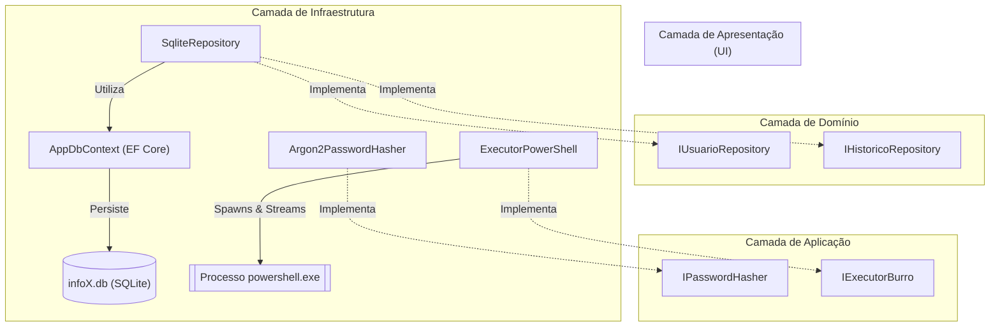

# Camada de Infraestrutura (Infrastructure)

## Visão Geral

A camada de **Infraestrutura** (`Infrastructure`) contém as implementações concretas dos contratos e interfaces definidos nas camadas de [Domínio](file:///e:/Projetos/github/infoX/Domain) e [Aplicação](file:///e:/Projetos/github/infoX/Application). Ela é responsável pela persistência de dados em banco relacional local (SQLite), segurança criptográfica (hashing de senhas com Argon2id) e execução assíncrona de processos do sistema operacional (PowerShell com streaming e controle de encoding UTF-8).



---

## Configuração

A biblioteca de classes da camada de Infraestrutura está configurada no arquivo [`Infrastructure.csproj`](file:///e:/Projetos/github/infoX/Infrastructure/Infrastructure.csproj):

- **Target Framework**: .NET 10.0 (`net10.0`)
- **Nullable**: `enable`
- **ImplicitUsings**: `enable`
- **Referências de Projeto**:
  - [`Domain.csproj`](file:///e:/Projetos/github/infoX/Domain/Domain.csproj)
  - [`Application.csproj`](file:///e:/Projetos/github/infoX/Application/Application.csproj)

### Pacotes NuGet

| Pacote | Versão | Propósito |
|--------|--------|-----------|
| `Microsoft.EntityFrameworkCore.Sqlite` | 10.0.10 | Provedor SQLite para o Entity Framework Core |
| `Microsoft.CodeAnalysis.CSharp.Scripting` | 5.6.0 | Compilação e execução dinâmica C# via Roslyn |
| `SQLitePCLRaw.lib.e_sqlite3` | 3.53.3 | Biblioteca nativa SQLite |
| `Konscious.Security.Cryptography.Argon2` | 1.3.1 | Hashing Argon2id (transitivo) |

---

## Estrutura

```
Infrastructure/
├── Infrastructure.csproj
├── Context/
│   └── AppDbContext.cs
├── Repositories/
│   └── SqliteRepository.cs
└── Services/
    ├── Argon2PasswordHasher.cs
    └── ExecutorPowerShell.cs
```

---

## Componentes

### AppDbContext
- **Namespace**: `Infrastructure.Context`
- **Herda de**: `Microsoft.EntityFrameworkCore.DbContext`

Contexto do Entity Framework Core para acesso ao banco SQLite.

#### DbSets

| Propriedade | Tipo | Descrição |
|-------------|------|-----------|
| `Usuarios` | `DbSet<Usuario>` | Tabela de usuários |
| `Historicos` | `DbSet<HistoricoExecucao>` | Tabela de histórico de execuções |

#### Conexão
Configuração dinâmica do caminho do banco:

```csharp
var dbPath = Path.Combine(AppContext.BaseDirectory, "infoX.db");
optionsBuilder.UseSqlite($"Data Source={dbPath}");
```

#### Configurações Fluent API
- **Usuario**: PK em `Id`, índice único em `Nome` (`entity.HasIndex(e => e.Nome).IsUnique()`)
- **HistoricoExecucao**: PK em `Id`, conversão do enum `Status` para string (`entity.Property(e => e.Status).HasConversion<string>()`)

---

### SqliteRepository
- **Namespace**: `Infrastructure.Repositories`
- **Implementa**: `IUsuarioRepository`, `IHistoricoRepository`

Repositório unificado que implementa ambas as interfaces de domínio em uma única classe.

#### Inicialização
- Recebe `AppDbContext` via DI
- Chama `_context.Database.EnsureCreated()` no construtor para garantir criação do banco

#### Métodos de Usuário

| Método | Comportamento |
|--------|---------------|
| `ObterUsuariosAsync()` | `_context.Usuarios.ToListAsync()` |
| `ObterPorUsernameAsync(nome)` | Busca case-insensitive com `ToLower()` |
| `CadastrarUsuarioAsync(usuario)` | Add + SaveChangesAsync |
| `ExcluirUsuarioAsync(nome)` | Find case-insensitive + Remove + SaveChangesAsync |
| `ExisteAlgumUsuarioAsync()` | `_context.Usuarios.AnyAsync()` |

#### Métodos de Histórico

| Método | Comportamento |
|--------|---------------|
| `SalvarAsync(historico)` | Add + SaveChangesAsync |
| `ObterHistoricoAsync()` | OrderByDescending por DataExecucao |

---

### Argon2PasswordHasher
- **Namespace**: `Infrastructure.Services`
- **Implementa**: `IPasswordHasher`

Implementação de hashing de senhas usando o algoritmo Argon2id.

#### Parâmetros

| Parâmetro | Valor |
|-----------|-------|
| Memória | 65.536 KB (64 MB) |
| Iterações | 4 |
| Paralelismo | 2 |
| Salt | 16 bytes (RandomNumberGenerator) |
| Hash | 32 bytes |

#### Formato de Saída

```
$argon2id$v=19$m=65536,t=4,p=2$<Base64Salt>$<Base64Hash>
```

#### Métodos
- `GerarHash(senha)`: Gera salt aleatório, computa hash Argon2id, retorna string formatada
- `VerificarSenha(senhaDigitada, hashSalvo)`: Parseia parâmetros do hash, recomputa e compara com `FixedTimeEquals`

---

### ExecutorPowerShell
- **Namespace**: `Infrastructure.Services`
- **Implementa**: `IExecutorBurro`

Executa comandos PowerShell como processos externos com streaming de output.

#### Configuração do Processo

```csharp
new ProcessStartInfo
{
    FileName = "powershell.exe",
    Arguments = $"-NoProfile -NonInteractive -Command \"chcp 65001 | Out-Null; [Console]::OutputEncoding = [System.Text.Encoding]::UTF8; {scriptEscapado}\"",
    RedirectStandardOutput = true,
    RedirectStandardError = true,
    UseShellExecute = false,
    CreateNoWindow = true,
    StandardOutputEncoding = Encoding.UTF8,
    StandardErrorEncoding = Encoding.UTF8
}
```

#### Funcionalidades
- **Encoding UTF-8**: Força `chcp 65001` e `[Console]::OutputEncoding = UTF8`
- **Streaming em tempo real**: Callback `Action<string>?` para cada linha de stdout/stderr
- **Stderr prefixado**: Linhas de erro recebem prefixo `[ERRO]: `
- **Cancelamento**: Registra `ct.Register(...)` para `process.Kill(entireProcessTree: true)`
- **Aguardo assíncrono**: `process.WaitForExitAsync(ct)`
- **Agregação**: `StringBuilder` acumula todo o output e retorna como string
