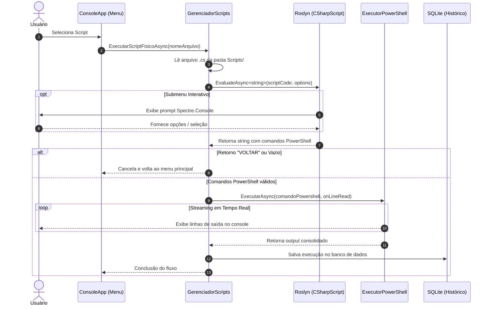

# Scripts — InfoX

## Como Funcionam os Scripts

Os scripts do InfoX são arquivos C# (`.cs`) armazenados na pasta `Scripts/` que são compilados e avaliados dinamicamente em tempo de execução pelo **Roslyn** (`Microsoft.CodeAnalysis.CSharp.Scripting`). Cada script atua como uma camada inteligente que gera comandos PowerShell sob medida para serem executados pelo `ExecutorPowerShell`.

Essa arquitetura separa a inteligência de negócios (filtros, prompts do console, validações e decisões condicionais escritas em C#) da camada de execução no sistema operacional (scripts nativos em PowerShell).

```
┌─────────────────────────────────────────────────────────────┐
│                        InfoX Console                        │
│                                                             │
│   ┌─────────────────────┐       ┌───────────────────────┐   │
│   │   Arquivo .cs       │       │    Roslyn Scripting   │   │
│   │ (Lógica + Menus C#) ├──────>│ (EvaluateAsync<string>)│   │
│   └─────────────────────┘       └──────────┬────────────┘   │
│                                            │ Gera script    │
│                                            ▼                │
│   ┌─────────────────────┐       ┌───────────────────────┐   │
│   │   Banco SQLite      │       │  ExecutorPowerShell   │   │
│   │ (HistoricoExecucao) │<──────┤  (Process + Streams)  │   │
│   └─────────────────────┘       └───────────────────────┘   │
└─────────────────────────────────────────────────────────────┘
```

### Fluxo de Execução

1. O `GerenciadorScripts` escaneia a pasta `Scripts/` por arquivos com extensão `.cs`.
2. O usuário seleciona um script através do menu interativo do console.
3. O conteúdo do arquivo `.cs` é lido do disco em memória.
4. O **Roslyn** compila e avalia o script invocando `CSharpScript.EvaluateAsync<string>()`.
5. Durante a avaliação, o script pode interagir com o usuário exibindo submenus e prompts via `Spectre.Console`.
6. O retorno do script (uma `string` contendo o comando ou script PowerShell) é encaminhado para o `ExecutorPowerShell`.
7. O `ExecutorPowerShell` inicia o processo `powershell.exe` e transmite as saídas padrão e de erro em tempo real via *streaming* para a interface.
8. Ao final da execução, o resultado consolidado e o status são persistidos no banco de dados SQLite (`HistoricoExecucao`).



### Referências e Imports Disponíveis

Os scripts executados pelo Roslyn possuem referências e namespaces configurados automaticamente pelo `GerenciadorScripts`:

* **Assemblies Referenciados:**
  * `System.IO.Path` (`System.Runtime.dll`)
  * `System.AppContext` (`System.AppContext.dll`)
  * `Spectre.Console` (`Spectre.Console.dll`)
* **Imports (Namespaces Usados Globalmente):**
  * `System`
  * `System.IO`
  * `Spectre.Console`

> [!NOTE]
> Para usar recursos de coleções genéricas ou LINQ em scripts com lógica avançada, basta adicionar `using System.Collections.Generic;` e `using System.Linq;` no topo do arquivo `.cs`.

### Convenções

* **Cancelamento Gracioso**: Retornar a string `"VOLTAR"` (ou string vazia/whitespace) cancela a execução imediatamente sem invocar o PowerShell e retorna ao menu anterior.
* **Nome Amigável**: O nome exibido nos menus corresponde ao nome do arquivo físico sem a extensão `.cs`.
* **Ordenação Alfanumérica**: Os scripts são listados em ordem alfanumérica. É altamente recomendado utilizar prefixos numéricos de dois dígitos (ex.: `01_`, `02_`, `99_`) para controlar a posição no menu.
* **Strings Raw e Interpolação**: Recomenda-se utilizar Raw String Literals do C# 11 (`"""..."""` ou `$$"""..."""`) para evitar conflitos de escape entre caracteres de escape do C# e sintaxe de variáveis do PowerShell (`$variavel`).

---

## Como Criar um Novo Script

Para adicionar uma nova funcionalidade ao InfoX, basta criar um arquivo `.cs` diretamente na pasta `Scripts/`. **Não é necessário recompilar o projeto**. O InfoX detectará o arquivo automaticamente na próxima listagem do menu.

### Exemplo Mínimo

```csharp
// Scripts/99_MeuScriptSimples.cs
return "Write-Host 'Olá do InfoX!' -ForegroundColor Green";
```

### Exemplo com Submenu Interativo

```csharp
// Scripts/98_DiagnosticoRapido.cs
using Spectre.Console;

var opcao = AnsiConsole.Prompt(
    new SelectionPrompt<string>()
        .Title("[green]Diagnóstico Rápido:[/]\nEscolha o comando que deseja executar:")
        .PageSize(10)
        .AddChoices(
            "1. Listar 10 processos com maior uso de CPU",
            "2. Listar serviços em execução",
            "0. Voltar"
        ));

if (opcao.StartsWith("0") || opcao == "Voltar")
{
    return "VOLTAR";
}

return opcao.StartsWith("1.")
    ? "Get-Process | Sort-Object CPU -Descending | Select-Object -First 10 | Format-Table Name, CPU, WorkingSet -AutoSize"
    : "Get-Service | Where-Object Status -eq Running | Format-Table Name, DisplayName, Status -AutoSize";
```

---

## Catálogo de Scripts

Abaixo está o detalhamento de todos os scripts nativos fornecidos com o InfoX:

---

### `01_BaixarVarredurasVirus.cs`

* **Objetivo**: Download automatizado de um kit de ferramentas portáteis de desinfecção e remoção de malwares.
* **Diretório de Destino**: Cria a pasta `Varredura de Vírus/` no diretório base da aplicação (`AppContext.BaseDirectory`).

#### Ferramentas Baixadas

| Ferramenta | Nome do Arquivo | URL de Download |
| :--- | :--- | :--- |
| **Kaspersky Virus Removal Tool** | `KVRT.exe` | `https://devbuilds.s.kaspersky-labs.com/devbuilds/KVRT/latest/full/KVRT.exe` |
| **Malwarebytes AdwCleaner** | `adwcleaner.exe` | `https://adwcleaner.malwarebytes.com/adwcleaner?channel=release` |
| **RogueKiller Portable (x64)** | `RogueKiller-Portable.exe` | `https://download.adlice.com/api?action=download&app=roguekiller&type=x64&os=win10&arch=x64` |

#### Características Técnicas
* Utiliza `Invoke-WebRequest -UseBasicParsing` para efetuar o download das ferramentas diretamente via PowerShell.
* Define `$ProgressPreference = 'SilentlyContinue'` para suprimir a barra de download nativa do PowerShell, garantindo compatibilidade com os spinners de carregamento da interface console.

---

### `02_ManutencaoDoSistema.cs`

* **Objetivo**: Diagnóstico, reparo da integridade do sistema de arquivos e da imagem do Windows (Component Store).

#### Menu de Opções

| Opção | Ação Executada | Descrição Detalhada |
| :---: | :--- | :--- |
| **1** | **Verificação Completa** | Executa a sequência completa autônoma: Agendamento de CHKDSK na unidade `C:`, DISM Inteligente e `sfc /scannow`. |
| **2** | **Agendar CHKDSK** | Envia `"Y"` para agendar `chkdsk c: /f` no próximo reinício do sistema. |
| **3** | **Executar SFC /scannow** | Executa a verificação e reparo de arquivos de sistema protegidos. |
| **4** | **DISM COMPLETO** | Executa `dism /online /cleanup-image /scanhealth` e, condicionalmente, dispara o `restorehealth`. |
| **5** | **DISM SCAN** | Executa apenas a varredura (`scanhealth`) para checar se a imagem do sistema está corrompida. |
| **6** | **DISM RESTORE** | Executa o reparo imediato da imagem do sistema (`restorehealth`). |
| **0** | **Voltar** | Cancela e retorna ao menu principal. |

> [!TIP]
> **DISM Inteligente**: O script executa o ScanHealth e analisa a saída em busca da assinatura `'component store is repairable'`. Se detectada, dispara o RestoreHealth automaticamente; caso contrário, encerra informando integridade preservada. O script também aplica filtros para suprimir as linhas da barra de progresso do DISM (`[===...]`), mantendo o log limpo.

---

### `03_Winget.cs`

* **Objetivo**: Gerenciamento automatizado de pacotes e softwares essenciais via Windows Package Manager (`winget`).

#### Menu de Opções

| Opção | Descrição |
| :---: | :--- |
| **1** | **Instalação inicial padrão**: Apresenta seleção múltipla dos softwares essenciais para bancada/formatação. |
| **2** | **Atualização geral de programas**: Executa `winget upgrade --all --accept-package-agreements --accept-source-agreements`. |
| **3** | **CCleaner Portable**: Baixa o arquivo `.zip` oficial da Piriform, extrai em `CCleanerPortable/` e remove o arquivo temporário compactado. |
| **0** | **Voltar** |

#### Softwares do Pacote Padrão (Seleção Múltipla)
* `AnyDesk.AnyDesk` — Acesso remoto
* `Google.Chrome` — Navegador web
* `7zip.7zip` — Compactador de arquivos
* `Adobe.Acrobat.Reader.64-bit` — Leitor de arquivos PDF
* `Oracle.JavaRuntimeEnvironment` — Ambiente de execução Java
* `StirlingTools.StirlingPDF` — Caixa de ferramentas PDF local

---

### `04_Limpezas.cs`

* **Objetivo**: Limpeza profunda, liberação de espaço em disco e remoção de rastros e caches do Windows.
* **Suporte à Seleção Múltipla**: Permite selecionar categorias individuais ou executar todas simultaneamente com a opção `0`.

#### Tabela de Limpezas Disponíveis

| # | Categoria | Ações e Comandos Executados |
| :---: | :--- | :--- |
| **0** | **TODAS** | Executa todas as 11 rotinas de limpeza em sequência. |
| **1** | **Event Viewer e Logs** | Limpa todos os canais de log de eventos via `wevtutil cl` e remove logs em `C:\Windows\Logs\*`. |
| **2** | **Pastas de Antivírus** | Remove pastas residuais de varreduras: `C:\KVRT_Data`, `C:\KVRT2020_Data`, `C:\AdwCleaner` e pastas do Adlice Software. |
| **3** | **Arquivos Temporários** | Remove recursivamente arquivos de `$env:TEMP` (usuário) e `C:\Windows\Temp` (sistema). |
| **4** | **Limpeza de Disco (Cleanmgr)** | Habilita todas as flags no registro (`VolumeCaches\StateFlags0001 = 2`) e dispara `cleanmgr.exe /sagerun:1`. |
| **5** | **Prefetch** | Esvazia o diretório de pré-carregamento `C:\Windows\Prefetch\*`. |
| **6** | **DISM Cleanup** | Executa a limpeza da base de componentes: `dism /online /cleanup-image /startcomponentcleanup`. |
| **7** | **Cache DNS** | Executa `Clear-DnsClientCache` para liberar o cache local do resolvedor de nomes. |
| **8** | **Microsoft Store** | Executa `wsreset.exe` em modo silencioso para redefinir o cache da loja. |
| **9** | **Windows Update** | Interrompe os serviços `wuauserv` e `bits`, esvazia `C:\Windows\SoftwareDistribution\Download` e reinicia os serviços. |
| **10** | **Lixeira** | Esvazia a lixeira de todas as unidades conectadas com `Clear-RecycleBin -Force`. |
| **11** | **Crash Dumps** | Remove despejos de memória e minidumps (`C:\Windows\Minidump\*` e `C:\Windows\MEMORY.DMP`). |

---

### `05_Inventario.cs`

* **Objetivo**: Levantamento completo de hardware, software, rede, periféricos e rotinas de backup para pré-formatação.
* **Pasta de Saída**: Os relatórios e arquivos compactados são salvos automaticamente na pasta `Inventarios/`.

#### Menu de Opções

| Opção | Funcionalidade | Detalhes Técnicos |
| :---: | :--- | :--- |
| **1** | **Resumo de Hardware/Sistema** | Coleta dados via WMI/CIM (`Win32_OperatingSystem`, `Win32_ComputerSystem`, `Win32_Processor`, `Win32_PhysicalMemory`, `Win32_LogicalDisk`) e exibe diretamente no console com cores e formatação legível. |
| **2** | **Relatório Completo em TXT** | Gera um arquivo `Inventario_<PCName>_<Data>.txt` com: Informações de SO/BIOS, Placa-Mãe, CPU, Memórias por Slot, Discos/Partições, Adaptadores de Rede e IPs, Impressoras instaladas, Usuários locais, Chaves do Windows e lista completa de Softwares instalados (32/64 bits). |
| **3** | **Backup Perfil Google Chrome** | Localiza a pasta `User Data\Default` do Google Chrome e gera um arquivo `.zip` com histórico, favoritos, preferências e dados do usuário. |
| **4** | **Backup Microsoft Outlook** | Localiza dados do Outlook em `AppData\Local` e `AppData\Roaming`, exporta chaves de registro dos perfis (`NTCurrentVersion\Windows Messaging Subsystem\Profiles` / `Office\*\Outlook\Profiles`), assinaturas (`Signatures`), listas de autocompletar (`RoamCache`) e arquivos `.pst`/`.ost` em um arquivo `.zip`. |
| **5** | **Pacote Pré-Formatação Completo** | Executa em cadeia as opções 2, 3 e 4, consolidando relatório técnico e backups essenciais do usuário antes de formatar a máquina. |
| **0** | **Voltar** | Cancela a operação e retorna ao menu anterior. |

---

### `06_DefinirProgramasPadrao.cs`

* **Objetivo**: Gerenciamento e padronização das associações de arquivos e programas padrão no sistema operacional.

#### Menu de Opções

| Opção | Descrição | Comandos / Mecanismos |
| :---: | :--- | :--- |
| **1** | **Exportar XML DISM** | Exporta as associações padrão atuais da máquina para `Configuracoes\AppAssoc_<PC>_<Data>.xml` usando `dism /online /Export-DefaultAppAssociations`. |
| **2** | **Importar XML DISM** | Solicita o caminho do arquivo XML e aplica como modelo padrão para novos perfis de usuário via `dism /online /Import-DefaultAppAssociations`. |
| **3** | **Google Chrome Padrão** | Configura ProgIDs de HTTP, HTTPS e extensões `.html`/`.htm` para o Google Chrome no registro do Windows. |
| **4** | **Adobe Reader Padrão** | Associa a extensão `.pdf` ao `AcroExch.Document.DC` no registro do sistema. |
| **5** | **7-Zip Compactador Padrão** | Associa formatos compactados (`.zip`, `.7z`, `.rar`, `.tar`, `.gz`) ao executável `7zFM.exe`. |
| **6** | **Abrir Configurações do Windows** | Abre a interface nativa de programas padrão executando `Start-Process ms-settings:defaultapps`. |
| **0** | **Voltar** | Retorna ao menu. |

---

### `07_AgendadorDeTarefas.cs`

* **Objetivo**: Otimização de desempenho e privacidade através da desativação seletiva de tarefas agendadas em segundo plano, telemetria e coleta de diagnósticos da Microsoft.

#### Categorias de Otimização (Seleção Múltipla)

| # | Categoria | Tarefas Agendadas Desativadas |
| :---: | :--- | :--- |
| **0** | **TODAS** | Aplica todas as 5 categorias de otimização listadas abaixo. |
| **1** | **Telemetria e CEIP** | `\Microsoft\Windows\Application Experience\Microsoft Compatibility Appraiser`<br>`\Microsoft\Windows\Application Experience\ProgramDataUpdater`<br>`\Microsoft\Windows\Application Experience\StartupAppTask`<br>`\Microsoft\Windows\Application Experience\PcaPatchDbTask`<br>`\Microsoft\Windows\Customer Experience Improvement Program\Consolidator`<br>`\Microsoft\Windows\Customer Experience Improvement Program\UsbCeip`<br>`\Microsoft\Windows\Customer Experience Improvement Program\KernelCeipTask` |
| **2** | **Feedback e Diagnósticos** | `\Microsoft\Windows\Feedback\Siuf\DmClient`<br>`\Microsoft\Windows\Feedback\Siuf\DmClientOnScenarioDownload`<br>`\Microsoft\Windows\Autochk\Proxy`<br>`\Microsoft\Windows\DiskDiagnostic\Microsoft-Windows-DiskDiagnosticDataCollector` |
| **3** | **Mapas do Windows** | `\Microsoft\Windows\Maps\MapsUpdateTask`<br>`\Microsoft\Windows\Maps\MapsToastTask` |
| **4** | **Xbox / GameSave** | `\Microsoft\XblGameSave\XblGameSaveTask`<br>`\Microsoft\XblGameSave\XblGameSaveTaskLogon` |
| **5** | **Relatórios de Erros (WER)** | `\Microsoft\Windows\Windows Error Reporting\QueueReporting` |

---

### `08_Firewall.cs`

* **Objetivo**: Hardening de segurança, liberação controlada de recursos de rede local, auditoria de alterações e backup de regras do Firewall do Windows Defender.
* **Segurança e Auditoria**:
  * Registra todas as ações aplicadas com carimbo de data/hora no arquivo `Configuracoes/Firewall_Audit.log`.
  * Cria backups automáticos das regras em `Configuracoes/Firewall_Backups/` antes de qualquer alteração, mantendo uma política de rotação automática dos últimos 20 backups (`.wfw`).

#### Menu de Opções

| Opção | Operação | Detalhes de Implementação |
| :---: | :--- | :--- |
| **1** | **Hardening de Segurança** | • Habilita os 3 perfis do Firewall (Domain, Private, Public).<br>• No perfil público: bloqueia conexões de entrada não solicitadas.<br>• Cria regras de bloqueio WAN (`InfoX_Block_*`) para portas de risco: RPC (135), NetBIOS (137-139), SMB (445), Telnet (23), FTP (21), SNMP (161-162), WinRM (5985-5986) e RDP (3389).<br>• Desativa protocolos legados inseguros: SMBv1 e LLMNR. |
| **2** | **Rede Local e Compartilhamento** | • Cria regras de liberação local (`InfoX_Allow_LAN_*`) restritas à sub-rede local (`LocalSubnet`).<br>• Libera Compartilhamento de Pastas/Arquivos (SMB 445/139), PING (ICMPv4 Echo), RDP interno (3389) e Descoberta de Rede (Network Discovery). |
| **3** | **Reverter Regras InfoX** | Localiza e remove exclusivamente regras com o prefixo `InfoX_*`, preservando regras originais do sistema e de aplicativos de terceiros. |
| **4** | **Backup Manual de Regras** | Exporta a configuração completa do Firewall para um arquivo `.wfw` usando `netsh advfirewall export`. |
| **5** | **Reset para Padrão de Fábrica** | Executa `netsh advfirewall reset`. Requer confirmação explícita de segurança no console e gera um backup prévio obrigatório antes do reset. |

---

### `09_PontoDeRestauracao.cs`

* **Objetivo**: Gerenciamento do serviço de Cópias de Sombra de Volume (VSS), configuração do tamanho reservado e criação/exclusão de Pontos de Restauração do Sistema.

#### Menu de Opções

| Opção | Ação | Detalhes Técnicos |
| :---: | :--- | :--- |
| **1** | **Criar Ponto de Restauração** | Habilita a proteção do sistema na unidade `C:`, desativa a trava de frequência mínima de 24 horas (`SystemRestore\SystemRestorePointCreationFrequency = 0`) e dispara `Checkpoint-Computer` com descrição informada pelo usuário. |
| **2** | **Listar Pontos e Espaço VSS** | Executa `Get-ComputerRestorePoint` e `vssadmin list shadowstorage` para exibir pontos existentes e o espaço de armazenamento alocado/utilizado. |
| **3** | **Customizar Espaço VSS** | Ajusta o limite máximo de armazenamento de cópias de sombra na unidade `C:` via `vssadmin resize shadowstorage /for=c: /on=c: /maxsize=<X>%` (opções: 5%, 10%, 15%, 20% ou porcentagem personalizada entre 1% e 50%). |
| **4** | **Excluir Ponto mais Antigo** | Executa `vssadmin delete shadows /for=c: /oldest /quiet` para liberar espaço retendo as restaurações mais recentes. |
| **5** | **Excluir Todos os Pontos** | Executa `vssadmin delete shadows /for=c: /all /quiet` mediante confirmação do operador. |
| **6** | **Abrir Assistente Gráfico** | Dispara o utilitário nativo de restauração do Windows executando `Start-Process rstrui.exe`. |
| **7** | **Ativar Proteção do Sistema** | Executa `Enable-ComputerRestore -Drive 'C:\'` garantindo que a unidade de sistema esteja monitorada. |
| **0** | **Voltar** | Retorna ao menu principal. |

---

### `12_Win11Debloat.cs`

* **Objetivo**: Otimização profunda e remoção de telemetria e bloatwares pré-instalados no Windows 11.
* **Mecanismo de Execução**:
  * Baixa e executa em memória o script comunitário de debloat do Windows 11 mantido por Raphi:
  ```powershell
  Write-Host 'Chamando o debloat...' -ForegroundColor Cyan
  & ([scriptblock]::Create((irm "https://debloat.raphi.re/")))
  ```

---

### `Teste.cs` / `Teste - Copy.cs`

* **Objetivo**: Scripts de teste, demonstração e validação do pipeline híbrido C# + PowerShell.
* **Mecanismo**:
  * Lê propriedades nativas do ambiente .NET em C# (`Environment.UserName`, `Environment.OSVersion.VersionString`).
  * Constrói e interpola uma mensagem dinâmica para exibição no console.
  * Emite um pipeline PowerShell formatado que consulta os 5 processos que mais consomem memória RAM:
  ```powershell
  Get-Process | 
      Sort-Object WorkingSet -Descending | 
      Select-Object -First 5 | 
      Format-Table Name, ID, WorkingSet -AutoSize
  ```
