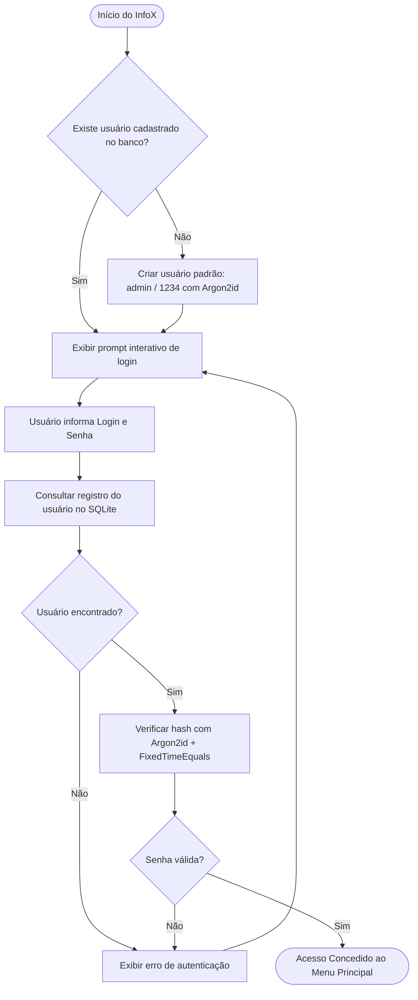
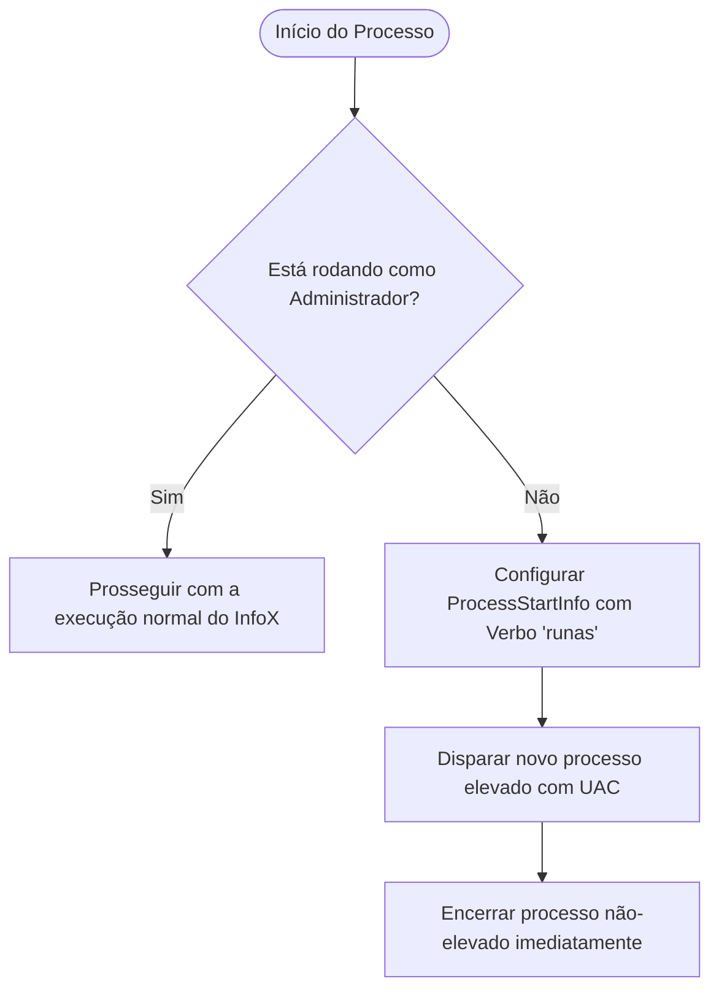

# Segurança — InfoX

## Visão Geral
O **InfoX** implementa múltiplas camadas de segurança para proteger o acesso às rotinas administrativas e garantir a integridade da execução de operações de baixo nível no ambiente Windows. O modelo de segurança abrange autenticação criptográfica robusta, garantia de privilégios elevados, isolamento e terminação segura de processos, hardening de rede via firewall e mitigação de corrupção de encoding em fluxos de I/O.

---

## Autenticação

### Fluxo de Login
A segurança de acesso ao sistema é controlada por uma barreira de autenticação logo no bootstrap da aplicação.



1. **Inicialização**: O sistema consulta a tabela de credenciais no banco SQLite.
2. **Seed Automático**: Caso nenhum registro exista (primeira execução), cria automaticamente o usuário administrador padrão (`admin` / `1234`) com hash seguro.
3. **Coleta de Credenciais**: O operador insere as credenciais via prompts interativos no console.
4. **Validação Criptográfica**: A senha fornecida é verificada contra o hash **Argon2id** armazenado.
5. **Tratamento de Falha**: Em caso de divergência de credenciais, o sistema bloqueia o acesso, notifica a falha e permanece em loop até que credenciais válidas sejam fornecidas.

---

### Hashing de Senhas — Argon2id
O InfoX utiliza o algoritmo **Argon2id** (vencedor oficial da *Password Hashing Competition*), fornecido pelo pacote criptográfico `Konscious.Security.Cryptography`. O Argon2id é uma variante híbrida que combina a resistência do Argon2d contra ataques baseados em aceleração por GPU/ASIC com a proteção do Argon2i contra ataques de canal lateral (*side-channel* e *cache-timing*).

#### Parâmetros de Configuração
| Parâmetro | Valor | Descrição |
| :--- | :--- | :--- |
| **Algoritmo** | `Argon2id` | Variante híbrida de alta segurança |
| **Memória (`m`)** | `65.536 KB` (64 MB) | Custo de memória alocada por cálculo de hash |
| **Iterações (`t`)** | `4` | Número de passadas completas sobre a memória |
| **Paralelismo (`p`)** | `2` | Número de threads concorrentes para o cálculo |
| **Salt** | `16 bytes` (128 bits) | Gerado criptograficamente via `RandomNumberGenerator.GetBytes()` |
| **Tamanho do Hash** | `32 bytes` (256 bits) | Tamanho da chave derivada resultante |

#### Formato do Hash Armazenado
Os hashes são persistidos no banco de dados em formato estruturado padronizado:
```
$argon2id$v=19$m=65536,t=4,p=2$<Base64Salt>$<Base64Hash>
```

- `$argon2id$`: Identificador do algoritmo.
- `$v=19$`: Versão do esquema do Argon2 (0x13 / v19).
- `$m=65536,t=4,p=2$`: Custo de memória em KB, número de iterações e paralelismo configurados no momento da geração.
- `$<Base64Salt>$`: Salt de 16 bytes encodado em Base64.
- `$<Base64Hash>$`: Hash derivado de 32 bytes encodado em Base64.

#### Verificação Segura
- **Prevenção contra Timing Attacks**: A comparação entre o hash gerado e o hash armazenado é realizada através de `CryptographicOperations.FixedTimeEquals()`, assegurando tempo constante de execução independentemente da quantidade de bytes coincidentes.
- **Extração Dinâmica de Parâmetros**: O validador extrai os parâmetros (`m`, `t`, `p`, `salt`) diretamente da string de hash do registro, garantindo retrocompatibilidade e facilitando futuras migrações para fatores de trabalho mais elevados sem quebra de hashes existentes.

---

## Elevação de Privilégios (UAC)

Muitos utilitários e rotinas integradas ao InfoX (como DISM, SFC, CHKDSK, manipulação de serviços, configuração de firewall e tarefas agendadas) exigem direitos administrativos plenos no Windows.

### Manifesto da Aplicação
O arquivo `app.manifest` do projeto declara explicitamente a necessidade de privilégios de Administrador:
```xml
<requestedExecutionLevel level="requireAdministrator" uiAccess="true" />
```

### Auto-Elevação Programática
Como camada de resiliência e garantia de execução em qualquer contexto de inicialização (por exemplo, quando iniciado a partir de consoles não-elevados), o ponto de entrada (`Program.cs`) realiza a verificação programática:



1. **Detecção**: Utiliza `WindowsPrincipal` e `WindowsBuiltInRole.Administrator` através da identidade `WindowsIdentity.GetCurrent()`.
2. **Relançamento com UAC**: Caso o processo atual não possua privilégios de administrador, instancia um novo processo configurando `ProcessStartInfo.Verb = "runas"`.
3. **Finalização Limpa**: A instância não-elevada é finalizada imediatamente, transferindo o controle para a nova instância elevada aprovada pelo prompt do UAC.

---

## Cancelamento Seguro de Processos

### Mecanismos de Cancelamento
O InfoX oferece controle total ao operador durante a execução de tarefas longas de diagnóstico e reparo por meio de múltiplos canais de cancelamento concorrentes:

- **Tecla ESC**: Uma thread/task em background monitora continuamente `Console.KeyAvailable` e a tecla `ConsoleKey.Escape`.
- **Sinal Ctrl+C / Ctrl+Break**: Registrado via manipulador `Console.CancelKeyPress`.
- **CancellationToken**: Ambas as origens acionam o mesmo `CancellationTokenSource`, propagando o sinal de cancelamento de forma assíncrona.

### Kill Seguro da Árvore de Processos
Ao acionar o cancelamento de uma rotina executada via PowerShell ou binários do sistema, o InfoX invoca:

```csharp
process.Kill(entireProcessTree: true);
```

> [!IMPORTANT]
> A flag `entireProcessTree: true` garante a terminação atômica do processo raiz (`powershell.exe`) e de **todos os processos filhos e netos** gerados (como `dism.exe`, `sfc.exe`, `chkdsk.exe`, subprocessos WMI/CIM, etc.), impedindo que processos órfãos permaneçam em execução invisível consumindo CPU/disco em background.

- **Auditoria de Estado**: O status da execução cancelada é imediatamente persistido no banco de dados como `StatusEnum.Cancelado` com timestamps e motivo do encerramento.

---

## Hardening e Segurança de Rede (Script de Firewall)

O módulo de firewall (`08_Firewall.cs`) implementa regras de *hardening* defensivo para proteção de hosts Windows, com ênfase especial na superfície de ataque de perfis de rede públicos.

### Portas e Protocolos Bloqueados (Perfil Público)
| Porta | Protocolo | Serviço / Vetor de Risco | Justificativa de Segurança |
| :--- | :--- | :--- | :--- |
| **135** | TCP | Microsoft EPMAP / RPC | Vetor frequente de exploração remota e enumeração de serviços |
| **137-139** | TCP / UDP | NetBIOS Name / Datagram / Session | Exposição de nomes de host, compartilhamentos e credenciais na rede |
| **445** | TCP | Microsoft SMB (Direct Host) | Prevenção contra movimentação lateral e ataques de ransomware |
| **23** | TCP | Telnet | Protocolo legado de comunicação em texto claro |
| **21** | TCP | FTP (Controle) | Transmissão insegura de credenciais e dados |
| **161-162** | UDP | SNMP (Agente / Trap) | Risco de vazamento de informações de telemetria e controle não autenticado |
| **5985-5986** | TCP | WinRM (HTTP / HTTPS) | Bloqueio de portas de gerenciamento remoto em redes não confiáveis |
| **3389** | TCP | RDP (Remote Desktop Protocol) | Prevenção de ataques de força bruta e exploração de vulnerabilidades RDP |

### Outras Medidas de Hardening
- **Desativação do protocolo SMBv1**: Desabilita o componente obsoleto `SMB1Protocol`, mitigando vulnerabilidades críticas baseadas em SMBv1 (e.g., EternalBlue).
- **Desativação de Resolução LLMNR**: Impede ataques de envenenamento e interceptação de credenciais via *Link-Local Multicast Name Resolution*.
- **Habilitação de Logging de Pacotes Descartados**: Configura o log nativo do Windows Firewall para registrar eventos de conexões descartadas (*dropped packets*) para análise forense.
- **Rotatividade Automática de Backups**: Antes de qualquer modificação estrutural, gera um backup completo da configuração do firewall (`.wfw`) com rotação automática mantendo as últimas 20 versões.
- **Auditoria Dedicada**: Todas as alterações e checagens de regras são registradas em log auditável em `Configuracoes/Firewall_Audit.log`.

---

## Encoding e Proteção contra Corrupção de Dados

Sistemas Windows em ambientes de língua portuguesa (pt-BR) utilizam tradicionalmente páginas de código legadas como `CP850` ou `Windows-1252`, o que frequentemente causa corrupção de caracteres em stdout/stderr de ferramentas de linha de comando.

O InfoX implementa padronização rigorosa em tempo de execução:
- **Console Output / Input Encoding**: Forçado programaticamente para `System.Text.Encoding.UTF8`.
- **Code Page UTF-8**: Execução de `chcp 65001` na inicialização de sessões de console.
- **Streams do PowerShell**: Configuração explícita de `[Console]::OutputEncoding = [System.Text.Encoding]::UTF8` e `$OutputEncoding = [System.Text.Encoding]::UTF8` nos runspaces e processos chamados.
- **Integridade de Logs e Parsing**: Evita falhas de regex e corrupção de saída em utilitários como `DISM`, `SFC` e `CHKDSK`, assegurando que acentuação, caminhos de arquivo e mensagens de diagnóstico sejam preservados integralmente no banco de dados e arquivos de log.
